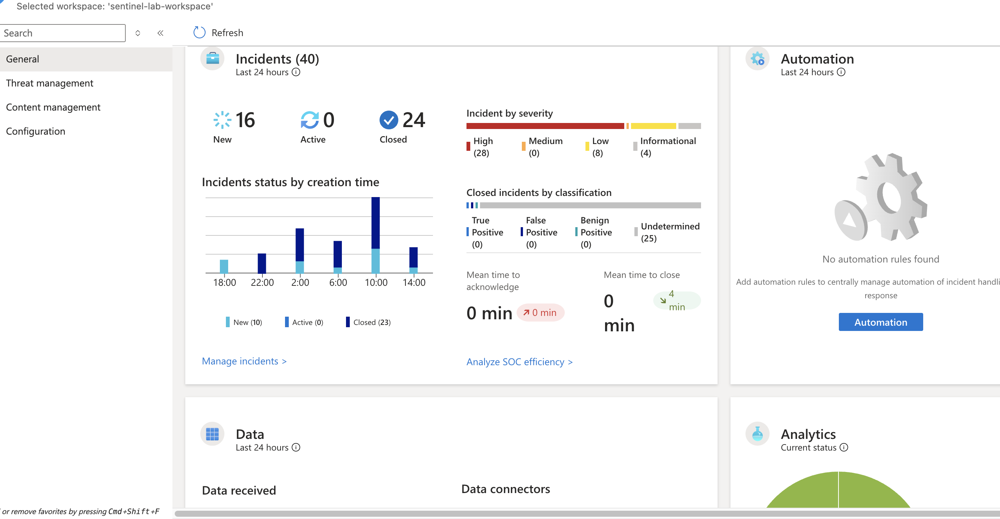
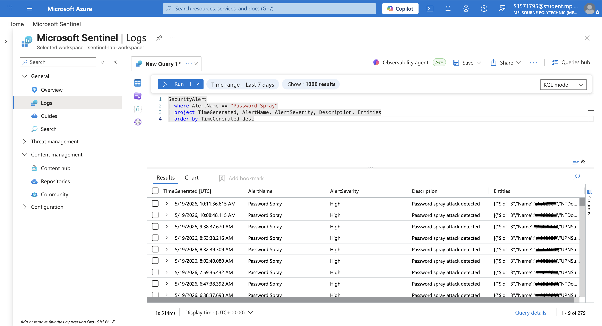
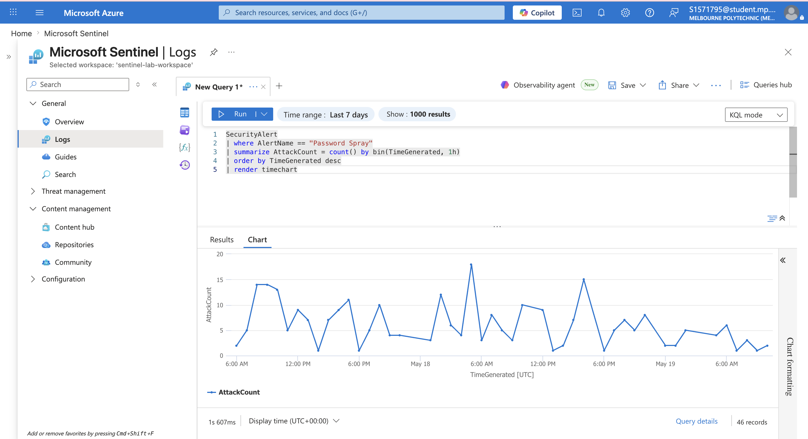
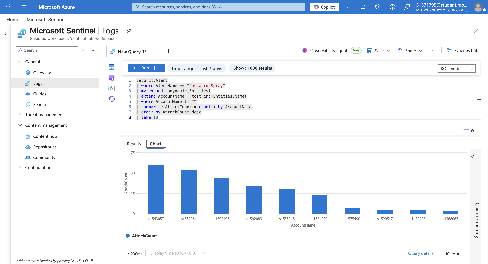
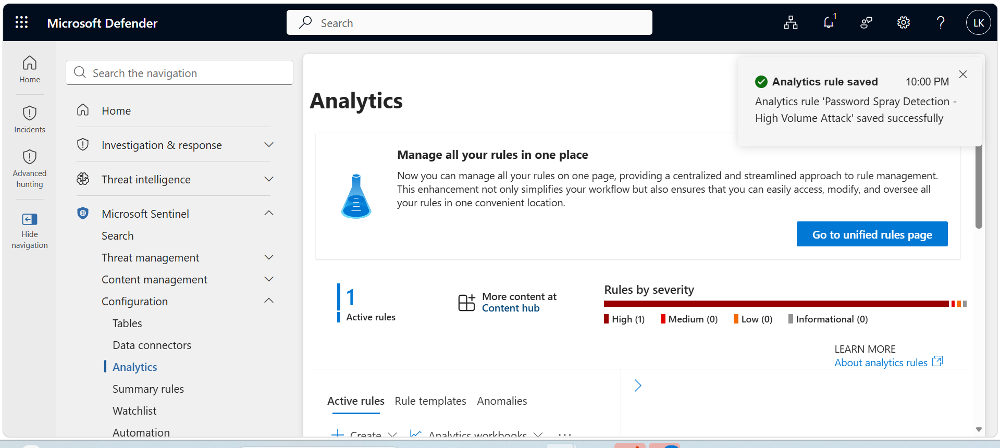
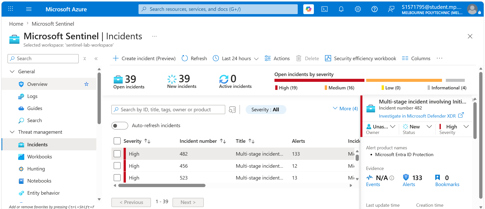
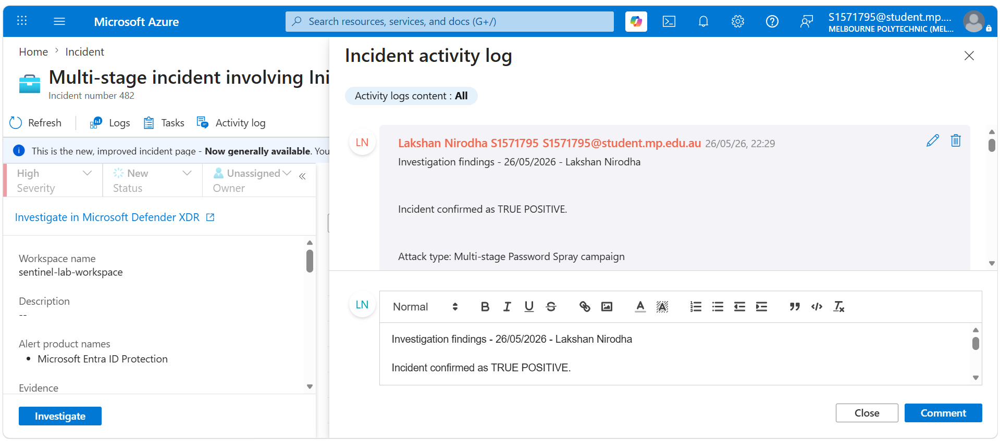
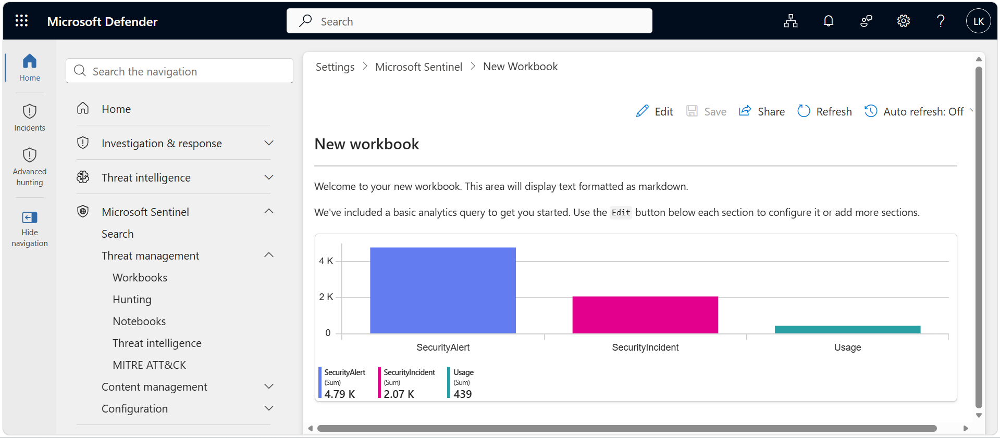

# 🛡️ Microsoft Sentinel SOC Lab
### Real-World Threat Detection & Incident Investigation


---

## 📋 Overview

This lab documents my hands-on experience deploying and using 
Microsoft Sentinel on Azure to detect and investigate a 
**real active cyberattack** targeting Melbourne Polytechnic 
Azure accounts.

While completing this lab I discovered a **live Password Spray 
attack campaign** — 279 HIGH severity alerts over 3 days 
targeting 57 university student accounts.

---

## 🏗️ Environment

| Component | Details |
|-----------|---------|
| **Platform** | Microsoft Azure (Azure for Students) |
| **SIEM** | Microsoft Sentinel |
| **Workspace** | sentinel-lab-workspace (Southeast Asia) |
| **Resource Group** | SentinelLabRG |
| **Data Connectors** | 7 active (Microsoft Defender XDR, Entra ID Protection, Defender for Endpoint, Defender for Identity, Defender for Cloud Apps, Defender for Office 365, M365 Insider Risk) |
| **Trial** | 31-day free trial activated |

---

## ✅ Lab Phases Completed

| Phase | Description | Status |
|-------|-------------|--------|
| Phase 1 | Deployed Microsoft Sentinel on Azure | ✅ Complete |
| Phase 2 | Configured 7 data connectors | ✅ Complete |
| Phase 3 | Wrote KQL queries — discovered live attack | ✅ Complete |
| Phase 4 | Created custom detection rule | ✅ Complete |
| Phase 5 | Investigated real incident #482 | ✅ Complete |
| Phase 6 | Created security dashboard workbook | ✅ Complete |

---

## 🚨 Real Threat Discovered

During Phase 3 I discovered a **live active attack** using KQL:

### Attack Summary
| Detail | Value |
|--------|-------|
| **Attack Type** | Password Spray — Multi-stage campaign |
| **MITRE Tactic** | Credential Access + Initial Access |
| **MITRE Technique** | T1110.003 — Password Spraying |
| **Total Alerts** | 4,790+ SecurityAlerts |
| **Attack Duration** | 3+ days continuous (May 17-26, 2026) |
| **Accounts Targeted** | 57 Melbourne Polytechnic students |
| **Attacker IPs** | Multiple (186.87.10.82, 196.117.73.223, 45.10.155.165) |
| **IP Pattern** | Multiple IPs — VPN/proxy usage detected |
| **Peak Attack Rate** | 18 attacks per hour |
| **Incident Severity** | HIGH |

### Attack Timeline
The attack ran continuously with automated bots:
- Started: 26/05/2026 03:06 AM
- Still active: 26/05/2026 10:11 PM
- Pattern: Attacks every 30 minutes around the clock

---

## 🔍 KQL Queries Written

### Query 1 — Discover All Tables
```kql
search *
| summarize count() by $table
| sort by count_ desc
```
**Purpose:** Discover which tables contain data in the workspace

---

### Query 2 — Find Password Spray Attacks
```kql
SecurityAlert
| where AlertName == "Password Spray"
| project TimeGenerated, AlertName, AlertSeverity, Description, Entities
| order by TimeGenerated desc
```
**Purpose:** Filter and display all Password Spray alerts with details

---

### Query 3 — Attack Timeline Visualisation
```kql
SecurityAlert
| where AlertName == "Password Spray"
| summarize AttackCount = count() by bin(TimeGenerated, 1h)
| order by TimeGenerated desc
| render timechart
```
**Purpose:** Visualise attack frequency over time as a chart

---

### Query 4 — Most Targeted Accounts
```kql
SecurityAlert
| where AlertName == "Password Spray"
| mv-expand todynamic(Entities)
| extend AccountName = tostring(Entities.Name)
| where AccountName != ""
| summarize AttackCount = count() by AccountName
| order by AttackCount desc
| take 10
```
**Purpose:** Identify which accounts were attacked most frequently

---

## 🔔 Custom Detection Rule Created

**Rule Name:** Password Spray Detection - High Volume Attack

| Setting | Value |
|---------|-------|
| **Severity** | High |
| **MITRE Tactic** | Credential Access |
| **MITRE Technique** | T1110.003 Password Spraying |
| **Run frequency** | Every 5 minutes |
| **Lookup period** | Last 1 hour |
| **Alert threshold** | Greater than 0 results |
| **Incident creation** | Enabled |
| **Test result** | True Positive — 15 attacks detected in test |
| **Status** | Active |

---

## 🔎 Incident Investigation — Incident #482

**Title:** Multi-stage incident involving Initial Access & Credential Access

| Detail | Finding |
|--------|---------|
| **Severity** | HIGH |
| **Total Alerts** | 133 |
| **Entities** | 57 accounts + multiple IPs |
| **Attack source** | Microsoft Entra ID Protection |
| **Tactics** | Initial Access + Credential Access |
| **Duration** | 03:06 AM to 22:29 PM (19+ hours) |
| **Classification** | True Positive — Confirmed |
| **Investigated by** | Lakshan Nirodha S1571795 |

### Investigation Finding
Confirmed multi-stage Password Spray campaign targeting 
Melbourne Polytechnic Azure accounts. Multiple attacker IP 
addresses identified suggesting VPN usage. Recommended 
immediate MFA enforcement and password reset for affected accounts.

---
## 🔍 Threat Intelligence Investigation

After detecting the attack I cross-referenced all attacker 
IPs with VirusTotal threat intelligence.

| IP | Country | ISP | VirusTotal Result |
|----|---------|-----|-------------------|
| 186.87.10.82 | Colombia 🇨🇴 | Telmex Colombia | 0/91 Clean |
| 45.10.155.165 | France 🇫🇷 | PacketHub S.A. | ⚠️ Suspicious (GreyNoise) |
| 196.117.73.223 | Morocco 🇲🇦 | MEDITELECOM | 0/91 Clean |

### Key Finding
The attacker used 3 different countries to avoid detection.
IP 45.10.155.165 (France, PacketHub S.A.) was flagged 
suspicious by GreyNoise — a hosting provider used for VPNs 
and rented attack servers.

All IPs showed clean reputation on standard blacklists —
meaning traditional IP blocking would have completely missed
this attack. Only behavioural detection through Microsoft
Sentinel KQL identified the threat.

This demonstrates why SIEM-based behavioural analysis is
essential in modern SOC environments.

---

## 📊 Screenshots

### Sentinel Overview Dashboard


### Password Spray Alerts — 279 Results


### Attack Timeline Chart


### Most Targeted Accounts


### Custom Detection Rule — Active


### Incident #482 Investigation


### Investigation Comment — Lakshan Nirodha


### Security Dashboard Workbook


---

## 📚 What I Learned

1. **Microsoft Sentinel deployment** — creating workspace, 
   connecting data connectors, activating SIEM from scratch

2. **KQL (Kusto Query Language)** — writing queries to filter, 
   summarise, and visualise security data

3. **Threat detection** — identifying Password Spray attacks 
   using SecurityAlert table analysis

4. **MITRE ATT&CK framework** — mapping attacks to T1110.003 
   Password Spraying under Credential Access tactic

5. **Incident investigation** — SOC Tier 1 workflow: open 
   incident, review evidence, analyse entities, document findings

6. **Detection engineering** — creating custom scheduled 
   analytics rules with KQL logic and automatic incident creation

7. **Real-world awareness** — cloud environments face continuous 
   automated attacks; automated detection is essential for SOC teams

---

## 🔗 Related Projects

- [Wazuh SIEM SOC Lab](https://github.com/LakshanNirodha/Wazuh-SIEM-SOC-Lab)
- [pfSense DoS Mitigation](https://github.com/LakshanNirodha/pfSense-DoS-Mitigation)
- [SafeLine WAF Deployment](https://github.com/LakshanNirodha/SafeLine-WAF-Deployment)
- [System Exploitation & Hardening](https://github.com/LakshanNirodha/System-Exploitation-and-Hardening)

---

*Completed as part of Microsoft Sentinel home lab — 
Melbourne Polytechnic IT Graduate 2026*
